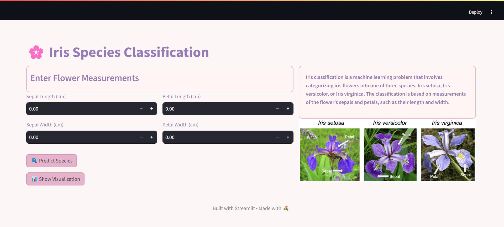
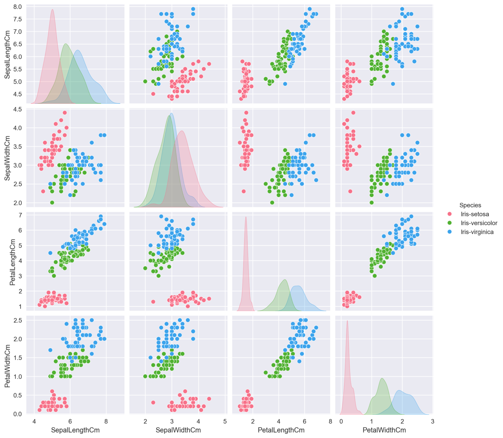

# **Iris Species Classifier**

This project focuses on building an **Iris Species Classifier**, capable of identifying iris species (Setosa, Versicolor, Virginica) based on flower measurements. The classifier processes numerical input for sepal and petal dimensions and predicts the species using a **Random Forest Classifier**.



---

## **1. Project Overview**

- Predicts the **species of iris flowers** based on sepal and petal measurements.
- Uses a **Random Forest Classifier** for efficient and robust classification.
- Visualizes the dataset and relationships between features to understand trends and insights.



---

## **2. Technologies Used**

- **Python 3.8**: For scripting and machine learning.
- **Pandas**: Data preprocessing and analysis.
- **Seaborn** & **Matplotlib**: Data visualization.
- **Scikit-learn**: Machine learning and hyperparameter tuning.
- **Streamlit**: Builds the interactive web interface.
- **Pickle**: Saves and loads the trained model.

---

## **3. Key Features**

### **3.1 Dataset**
- Uses the **Iris dataset**, a well-known dataset for classification tasks, containing sepal and petal measurements for three iris species.
- Preprocessed to remove unnecessary columns (e.g., Id).

### **3.2 Data Visualization**
- Relationships between features (e.g., Sepal Length vs. Petal Width) are visualized using **pair plots**.
- Distribution of species across the dataset is analyzed.

### **3.3 Model Architecture**
- A **Random Forest Classifier** is used for species prediction.
- Features include Sepal Length, Sepal Width, Petal Length, and Petal Width.

### **3.4 Training and Validation**
- Dataset is split into **80% training and 20% testing**.
- Model accuracy and performance are evaluated using metrics like:
  - **Confusion Matrix**
  - **Classification Report**

### **3.5 Hyperparameter Tuning**
- Grid Search is implemented to optimize hyperparameters such as:
  - Number of estimators (50, 100, 200)
  - Maximum depth (None, 10, 20)

### **3.6 Interactive Web Application**
- A **Streamlit-based frontend** for:
  - Inputting flower measurements.
  - Predicting the species in real-time.
  - Visualizing dataset trends and classification results.

### **3.7 Model Saving and Reloading**
- The trained model is saved using **Pickle** for reuse in predictions.

---

## **4. Model Training**

### **4.1 Data Preprocessing**
- Unnecessary columns removed (e.g., Id).
- Species labels are encoded using **LabelEncoder**.

### **4.2 Training**
- The Random Forest model is trained with the following configurations:
  - **100 estimators**
  - **Maximum depth of 10**
- The model achieves high accuracy on the test set.

### **4.3 Validation**
- Metrics such as precision, recall, F1-score, and accuracy are calculated.
- Confusion matrix provides insight into misclassifications.

### **4.4 Hyperparameter Optimization**
- Best parameters identified using **GridSearchCV**.

---

## **5. How to Run the Project**

1. Clone the repository.
2. Install the required dependencies:
   ```bash
   pip install -r requirements.txt
   ```
3. Run the application:
   ```bash
   streamlit run app.py
   ```
4. Input flower measurements on the web interface to predict the iris species.
5. Visualize relationships and trends in the dataset.

---

## **6. Project Structure**

```bash
- data/                      # Directory containing the Iris dataset
- app.py                     # Streamlit-based web interface
- iris_model.pkl             # Pickle file storing the trained model
- iris.csv                   # Dataset file
- train_model.py             # Code for training the Random Forest model
```

---

## **7. Future Scope**

### **7.1 Feature Addition**
- Incorporate additional features or environmental data for more complex classification tasks.

### **7.2 Model Improvement**
- Explore advanced machine learning algorithms like XGBoost or Neural Networks.

### **7.3 Deployment**
- Optimize the model for deployment on lightweight edge devices.

### **7.4 User Interface Enhancements**
- Add more interactive visualizations and insights in the web app.

---
